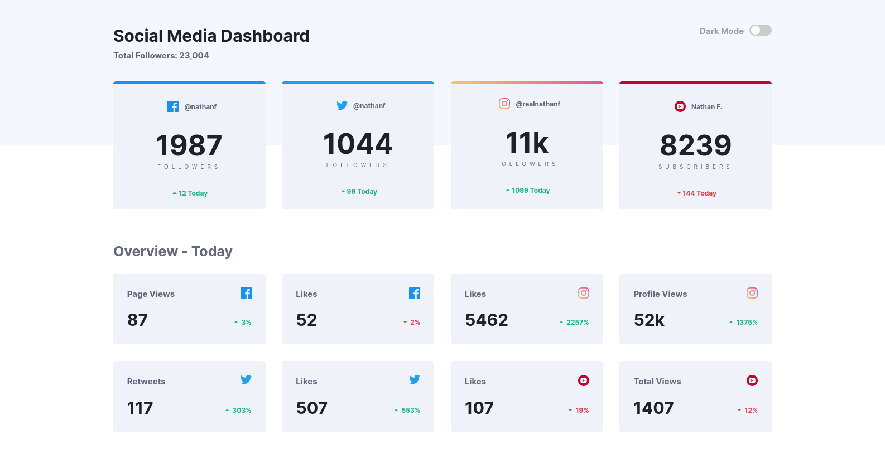
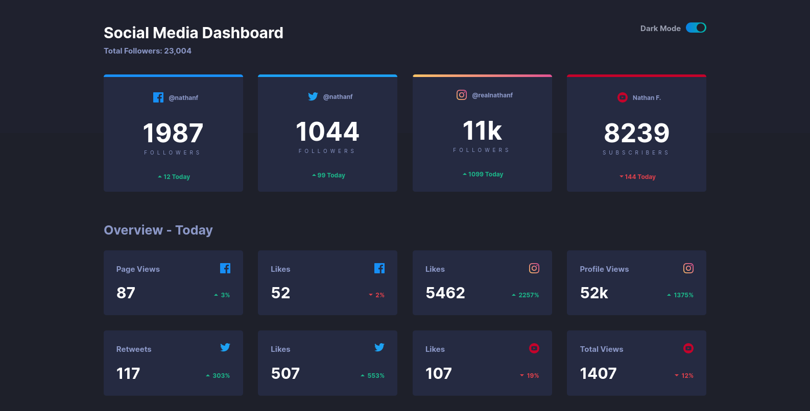

# Frontend Mentor - Social media dashboard with theme switcher solution

This is a solution to the [Social media dashboard with theme switcher challenge on Frontend Mentor](https://www.frontendmentor.io/challenges/social-media-dashboard-with-theme-switcher-6oY8ozp_H). Frontend Mentor challenges help you improve your coding skills by building realistic projects.

## Table of contents

-   [Overview](#overview)
    -   [The challenge](#the-challenge)
    -   [Screenshot](#screenshot)
    -   [Links](#links)
-   [My process](#my-process)
    -   [Built with](#built-with)
    -   [What I learned](#what-i-learned)
-   [Author](#author)

## Overview

### The challenge

Users should be able to:

-   View the optimal layout for the site depending on their device's screen size
-   See hover states for all interactive elements on the page
-   Toggle color theme to their preference

### Screenshot

Light schema of the page.

Dark schema of the page.

### Links

-   Solution URL: [Add solution URL here](https://github.com/okcomputer93/social-media-dashboard)
-   Live Site URL: [Add live site URL here](https://okcomputer93.github.io/social-media-dashboard)

## My process

### Built with

-   Semantic HTML5 markup
-   CSS custom properties
-   Flexbox
-   CSS Grid
-   Grid SASS

### What I learned

I used grid to make a responsive layout with less media queries. To acomplish this I emply auto-fit and minmax properties on repeat().
The result is a layout that decreases with the screen width with minimun use of media queries.

## Author

-   Github - [@okcomputer93](https://github.com/okcomputer93)
-   Frontend Mentor - [@okcomputer93](https://www.frontendmentor.io/profile/okcomputer93)
